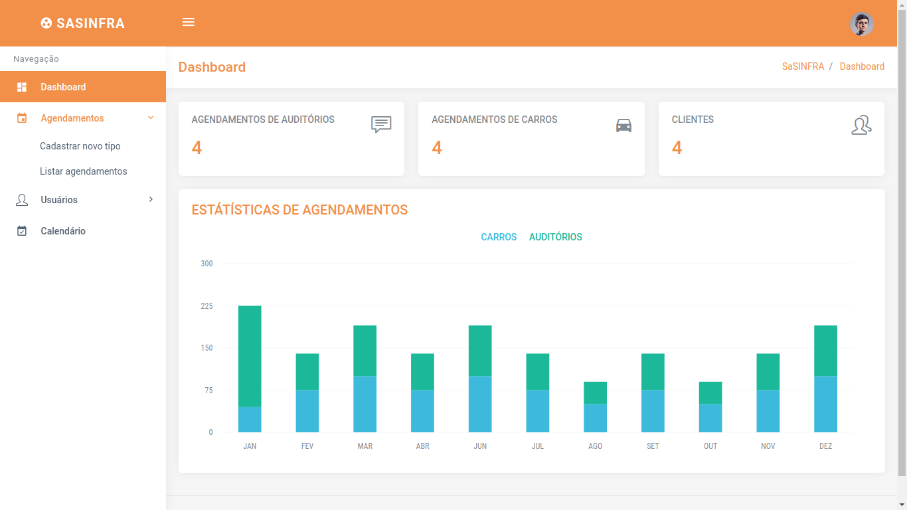

# SaSINFRA

## Description

SaSINFRA (**S**istema de **a**gendamentos da **S**uperintendência de **Infra**estrutura - Scheduling system of the Infrastructure Superintendence) allows the employees of the Infrastructure Superintendence to schedule cars for works visits, as well as schedule auditoriums for possible meetings and project submissions.

This 

## Some pages

### Admin side

### Client side

## Team

 |  | 
---|---|---
[Breno Viana](https://github.com/brenov) | [Patrícia Cruz](https://github.com/Pekorishia) | [Jackson Rauup](https://github.com/jacksonrauupti)